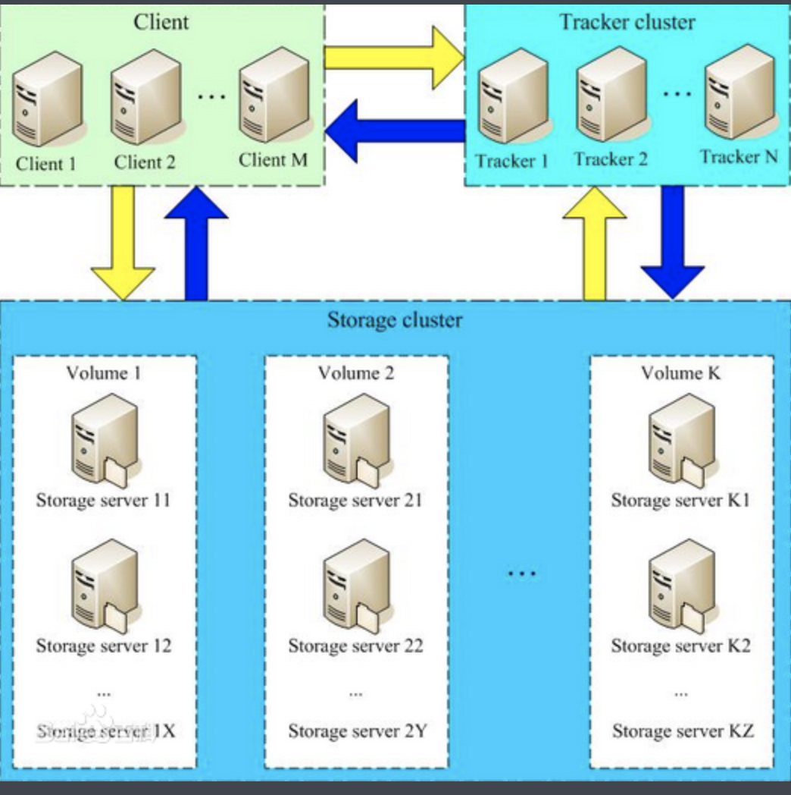

# 架构

## 架构分析

FastDFS系统有三个角色： 跟踪服务器(tracker server)，存储服务器(storage server)和客户端；

* tracker server: 
  * 主要做调度工作，并对sorage server起到负载均衡的作用；
  * 负责管理所有的sorage server和group,每个storage在启动后都会链接到tracker，并告知自己所属的group信息，保持周期性心跳；
  * tracker server可以有多台，tracker server之间的相互平等关系提供服务器，tracker server不存在单点故障，客户端请求tracker server采用轮询的方式，如果请求的tracker服务器无法提供服务，在更换另外一个tracker

* strorage server:
  * 主要提供容量和备份服务；
  * 以group 为单位，不同group之前相互独立，每个group可以有多台storage server，数据相互备份；
  * 采用分组存储的方式好处是灵活，可控性强，如果上传文件时，可由客户端之间指定上传到的组

* client 
  * 客户端应用程序；

  

